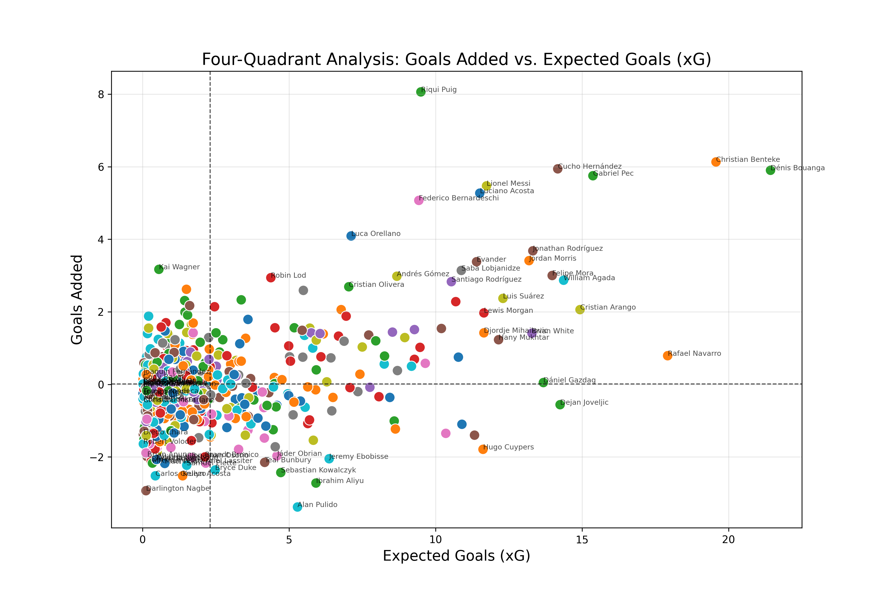
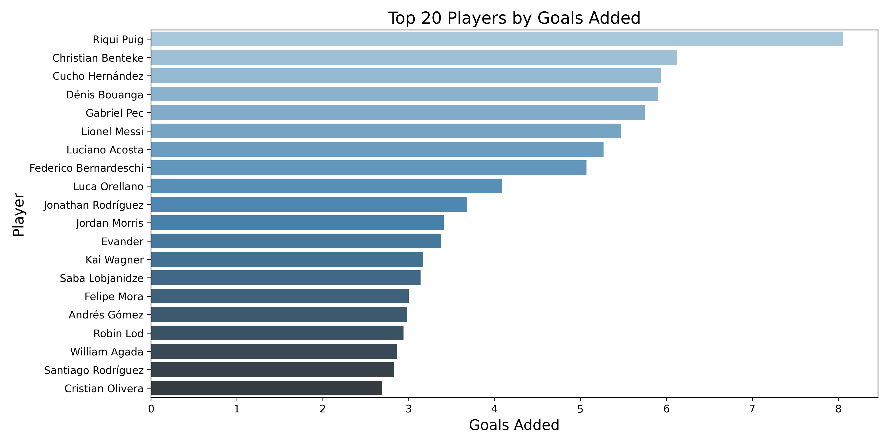
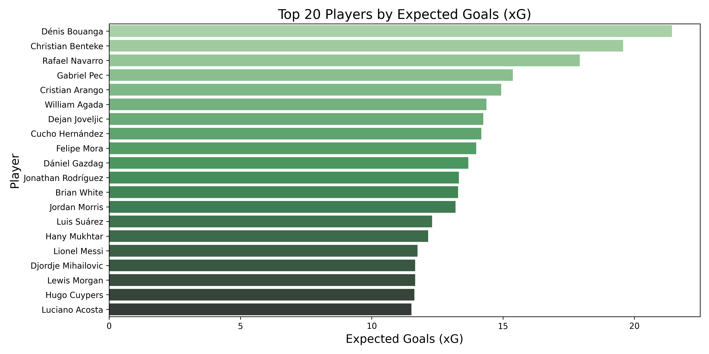
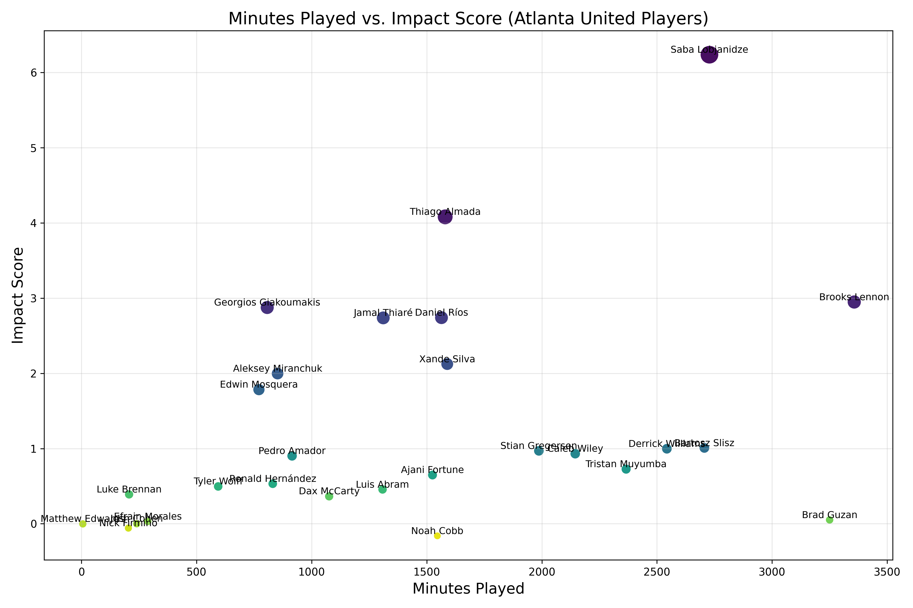
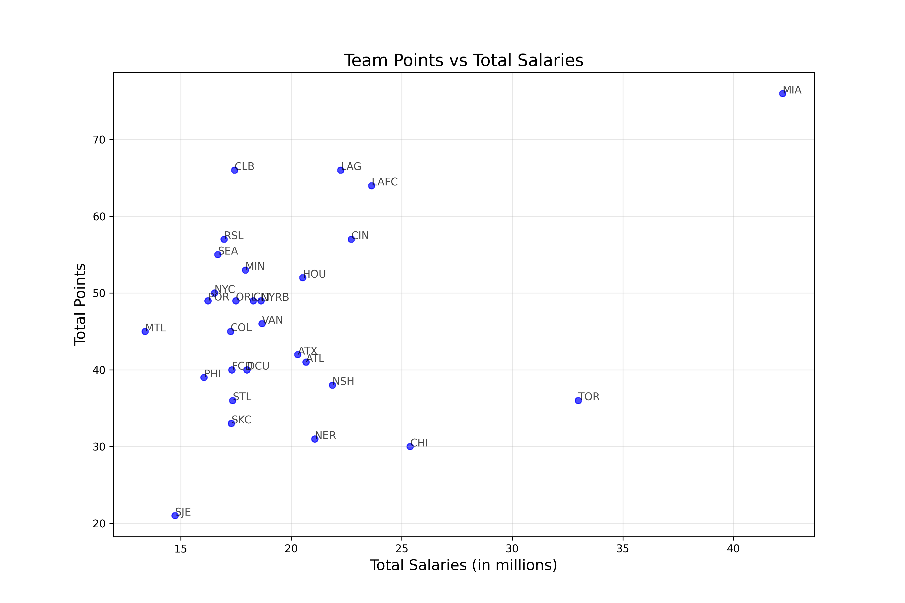

# Atlanta United Database Pipeline

## Overview

I am tasked with developing an automated data pipeline that ingests data from the American soccer analysis app (https://app.americansocceranalysis.com/#!/mls)
where I am given the following key tasks:

- Table Creation:
  - Match Data: Contains Game-level data
  - Salary Analysis: Aggregate team level salaries for the 2024 MLS season
  - Player Stats: Individual playuer performance metrics like expected goals, expected assists and goals added
- Automated ingestion and transformation process
- Data Visualizations to depicts relationships as examples of future analysis
- Discuss challenges, assumptions and deployment instructions

## Database Shell Selection

I've chosen to use PostgreSQL as my database of choice, I've used PostgreSQL in the past and it seems to work well with the task at hand.
PostgreSQL is super reliable and scabale, provides strong functionality for handling advanced datatypes and frankly, its a database housing software I've used in past experiences

## Set up

1. Clone the repository

2. if using a venv:

- python3 -m venv venv
- source venv/bin/activate

3. Install the dependencies: `pip3 install -r requirements.txt`

- (If using venv, `python3 -m pip install -r requirements.txt`)

- Databse: sqlalchemy, psycopg2, pandas
- Visualization: matplotlib, seaborn
- Environment: python-dotenv
- Data Analysis: numpy, pandas

4. Create an .env file in the source (src) directory with the following structure
   DB_HOST=localhost
   DB_PORT=5432
   DB_NAME=your_database_name
   DB_USER=your_username
   DB_PASSWORD=your_password

to connect to your local PostgreSQL database

5. Run the pipeline from the root directory: `python3 src/automate_pipeline.py

## Ingestion and Cleaning

The pipeline automates the ingestion and cleaning of various CSVs found on the American Soccer Analysis Website whcih include

- Team Aggregate Salaries
- xGoals per game
- xGoals per player across 2024
- xPass per player acrpss 2024
- Goals Added per player across 2024

I simply downloaded these files from the app and imported them into the data directory found in this repository

### Preprocessing and Cleaning

My whole pipeline of preprocessing and cleaning are all done in the ingestion.py file where I do the following tasks:

- Rename the columns to align with my PostgreSQL schema
- Drop Duplicate Values
- Remove columns that hold no value
  - Player Pictures took up a column on the app and produced an "unnamed" column
  - Rows with empty strings were removed as that produced invalid data
- Handle NA rows by filling with 0s

At first I cleaned and loaded each of these CSVs into my db as separate preprocessing functions but opted to consolidate them all into general preprocessing, cleaning and loading functions to reduce code duplication.
Each process has sufficient logging in the console to depict their process of
setting up tables, processing and preparing CSV data for loading, loading the data and then succeeding so the user has knowledge of the process

### Transformation and Feature Engineering

The transformation adn feature engineering tasks were primarily done in the transform.py file where we do the following:

#### Player Performance Metrics Table

- Given the xGoals, xPass and GoalsAdded CSV files that were then ingested into separate tables it seemed pretty apparent that they should be combined based on the player, team and season to depict the season stats for a player.

  - Merging these datasets was important to provide a full picture on the performances of players and how they impacted their teams, where you can now find in player_performance metrics, you can find:
    - xGoals
    - xAssists
    - Key Passes
    - Goals Scored
    - Minutes played
    - Player Info (Team, Position, Season)
    - And a cast plethora of other stats that contribute to their individual metrics
  - Each player has a unique ID to handle duplicates and ensure data integrity and consistency

#### Per 90 Metrics

Calculated the per 90 minute metrics for key stats such as:

- Goals Added per 90
- xGoals per 90
- xAssists per 90
- Passes per 90
- Shooting Metrics per 90

This can provide some knowledge of players with differing minutes. For example if two players have the same goals and xG but one plays half the minutes as the other, the player with the lesser minutes would appear to be more impactful as we are taking into account on a per 90 basis. This can prevent confusion and misconceptions.

#### Efficiency Metrics

Added several efficiency metrics to evaluate player performances such as

- Goal Conversion Rate: Goals scored per shot taken
- Shot Accuracy: Shots vs Shots on Target
- xG Conversion Rate: How effective a player converts xG to goals
- Key Pass to Assist Ratio: Efficiency at converting those key passes to assists
  - (This is also pretty dependent on the finisher as well)

### Data Visualization and Visualization

The data_analysis.py and atlanta_united_metrics.py all are used in providing examples on how you can analyze and visualize the data transformed in the first steps of this pipeline

#### Player Performance Metrics Table Analysis

- Using the Player Performance Metrics Table allowed for simple data analysis where graphics such as top xg players, top goals added players and merging those metrics into one plot were possible:
  

  By labeling the top percentile of players we focus on the players that either impact the game with a high xGoal or GoalsAdded metric or we want to see the players that negate from their team in either stat, this provides us knowledge on who may be the most important players in the MLS and potentially for Atlanta United, who they should target

  
  
  These are just simple bar graphs that show the players that reign the highest in goals added and xGoals.

#### Atlanta United Impact Charts

Given of course this is for an Atlanta United Project, I wanted to do a general analysis of who are the most impactful players on the squad and where they rank in comparison to each other.
In doing this study, I decided to give xG a 0.4 multiplier and xPass and GoalsAdded a 0.3 multiplier
Why?

- xG: This represents a players ability to create high quality shots for themselves and most directly correlates to a players offensive impact
- xA: Of course the assist is crucial for scoring chances but given the goal typically stands as the most important component, we shouldn't overshadow that impact
- Goals Added: This can arguably be viewed similarly to xA as this really provides a holistic measure of a players overall impact on the field but just not as directly as the goal scorer

For players that are more defensive minded players and aren't as directly correlated to scoring, this impact metric doesn't necessarily reflect their impact on the field and perhaps directly looking at goalsAdded might provide more balance in analyzing their affects.
But with these metrics I looked how impactful players were with respect to the minutes played of the player

This chart shows a little bit of my claim, Brooks Lennon, an important right wing back for the club doesn't seem to show as impactful of a role to the teams success as someone like Lobzhanidze but still shows quality as he has the most minutes across the season and a relatively high impact score regardless of being a defender.

#### Salaries vs Wins

Lastly I wanted to provide some analysis on how a teams total guaranteed salaries contributed to wins and if "the more money you have, the better your club should be" plays out correctly

To do this, unless I overlooked something, there isn't necessarily a wins, ties and losses columns through these tables, so I decided to calculate those myself. Originally, I only looked at wins, but then realized this really wasn't providing a full breakdown of how successful a team was. Since a team can potentially have 0 wins and 20 ties and would have a more successful season than a team with 5 wins and 15 losses

Heres my process:
In the data_analysis.py, I wrote function calculate_total_points to calculate the total points for each team based on results from xgoals_games

- Win: 3 points
- Tie: 1 point
- Loss: 0 points

I created 3 boolean columns, home_win, away_win, tie using pandas and then based on these columns, I calculated the total points for each team by summing the home and away points

The salaries table was straight forwards as I just fetched the corresponding team string and combined the two results into a dataframe for plotting.

Crazy how much money was spent by Inter Miami CF and shows how much of an impact that had in their success across the season but interestingly enough the remainder of the league remains pretty sporadic as there isn't a clear relationship between the money spent and their success as we see that Toronto FC even though they spent the second most, is arguably one of the least successful teams this year.

We've seen a similar trend amongst European teams, where teams like Manchester United (my favorite team sadly), are struggling regardless of being ranked 2nd in wealth which hasn't resulted in much success this year but rather has us almost at the bottom of the table (hopefully Bruno Fernandes can save us because who else will).

### Test

- Wrote some small tests to analyze how ingestion and tranforming behave to ensure that the loading and trasnforming of data was behaving as expected and used some sql files to do some testing while building the pipeline

### Challenges Faced

1. Data Inconsistencies

- For Tables that included a Team Logo or Player Profile, that column would be downloaded as an empty string and provide no use for our analysis so making sure we remove that column during the preprocessing stage was important to ensuring clean code

2. Players with same name

- Giving each player, season, club a unique identifier was important to preventing duplication issues and we then were able to give unique identifiers to each player accordingly to ensure data integrity

3. Database overwriting vs appending

- I noticed that my code was calculating obscene metrics for wins and losses and wasn't understanding why but due to python syntax, not specifying I wanted to replace the table information rather than append caused summations that didn't make sense but was fixed with some simple debugging

4. Visualization Noise

- With some analysis, players specifically, there was so much to be analyzed and amongst the normal distribution of players, the number of players that were in the 50th percentile caused confusion in readability
  - So understanding the balance of what to show and what to hide was important to maintaining clean visualizations

### Future Improvements

1. Scheduling a cron job to run this automation to ensure clean code on a regular basis

- Automate the downloading the datasets can also be considered here
- can be done using an api to fetch it from the American Soccer Analysis App

2. Full Stack Application

- This type of analysis can be easily transitioned into your own personal web app where you can visualize tables and graphs with filters for real time exploration of team and player performance
  - can easily delve into player to player comparison, leaderboards, etc

3. Machine Learning and further data engineering

- I've provided some pretty simple analysis of the data given, but analysis can definitely can more complicated but insightful
  1. Player performance Predictions:
  - based on data on playtime data and performance, predict the goalsAdded, xG, xA based on players of the similar position
    - Maybe use a Linear Regression model or Random Forest
    - Can provide knowledege of scouting potential players, underperforming players and how they can contribute to Atlanta United
  2. Player Chemistry and optimal lineup
  - Given how players play with different players in a game across multiple, we can analyze the player performance and what lineups are most opitimal and produce the highest goalsAdded and xG
